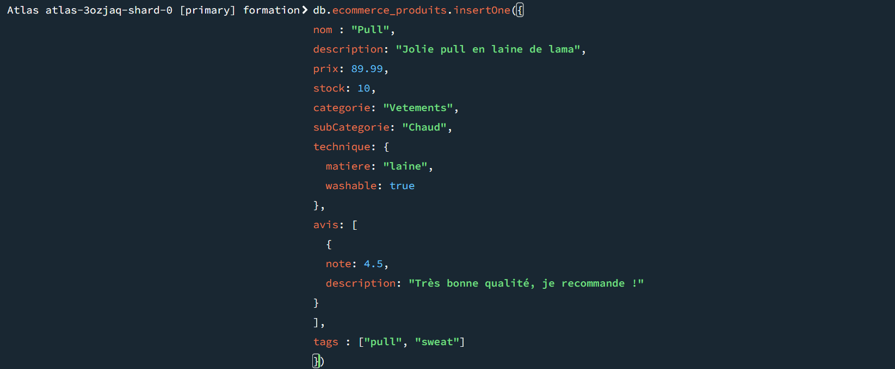

# Exercice

## TP2

### Exercice 1

2.  pour tester
   puis db.ecommerce_produits.insertMany([]) avec 9 autres éléments

### Exercice 2

1.

```js
db.ecommerce_produits.find({ categorie: "Vetements" });
```

2.

```js
db.ecommerce_produits.find({
  $and: [{ prix: { $gt: 50 } }, { prix: { $lt: 200 } }],
});
```

3.

```js
db.ecommerce_produits.find({ stock: { $gt: 0 } });
```

4.

```js
db.ecommerce_produits.find({ $expr: { $gte: [{ $size: "$avis" }, 3] } });
```

### Exercice 3

1.

```js
db.ecommerce_produits.updateMany(
  { categorie: "Vetement" },
  { $mul: { prix: 1.05 } }
);
```

2.

```js
db.ecommerce_produits.updateMany(
  { categorie: "Vetement" },
  { $set: { promotions: "-50%" } }
);
```

3.

```js
db.ecommerce_produits.updateMany(
  { categorie: "Vetement" },
  { $push: { tags: "Geek" } }
);
```

4.

```js
db.ecommerce_produits.updateMany(
  { _id: ObjectId("67c589d6f1c87978b638f9ce") },
  { $inc: { stock: -1 } }
);
```

### Exercice 4

1.

```js
db.ecommerce_produits.find({
  $and: [{ tags: "pull" }, { tags: "color" }],
});
```

2.

```js
db.ecommerce_produits.updateMany(
  { prix: { $gt: 75 } },
  { $set: { premium: true } }
);
db.ecommerce_produits.find({
  $and: [{ premium: true }, { stock: { $lt: 5 } }],
});
```

3.

```js
db.ecommerce_produits.find({
  avis: {
    $elemMatch: { note: { $eq: 5 } },
  },
});
```

4.

```js
db.ecommerce_produits
  .find({ categorie: "Vetements" })
  .limit(5)
  .sort({ prix: -1 });
```

## TP3

### Exercice 1

